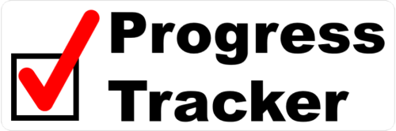

A simple program for tracking and organizing tasks.

# Description
Progress Tracker is an easy-to-use program for track progress towards project completion. Create individual tasks, assign due dates, set prerequisite requirements, and more. Visualize task data to track overall progress. Share data by exporting it to various file formats (.pdf, .csv, and .md).

After mostly programming using Java and MATLAB for years, I am working to familiarize myself more with Python. Over the past couple of years, I have had trouble finding a digital task list app that offered all of these features without tedious interfaces for free. Instead of trying out a less useful classroom example, I decided to learn Python while making something I will actually use in the future.

# Requirements
Here is what you need to be able to run this program:
* [Dear PyGui](https://github.com/hoffstadt/DearPyGui) (1.5.1+)

# Roadmap
- [ ] UI
  - [ ] Theme
  - [ ] Main Menu
  - [ ] Project Overview
  - [ ] Create/Edit Task
- [ ] Saving
- [ ] Settings
- [ ] Export Options